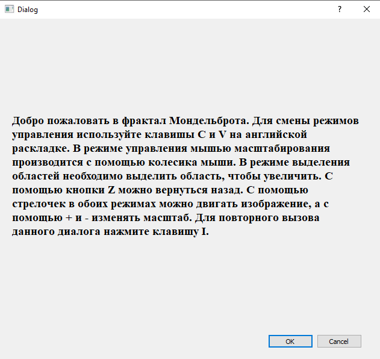
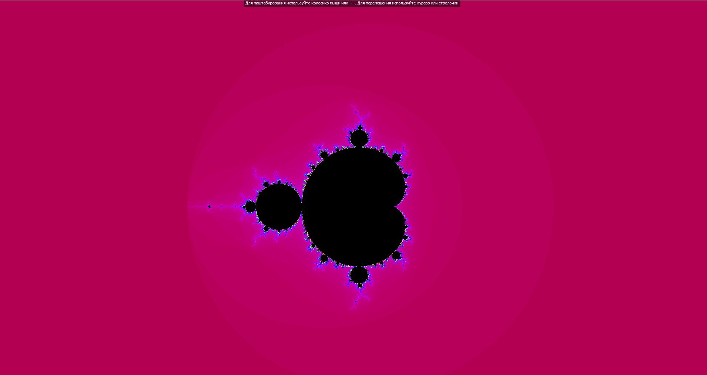
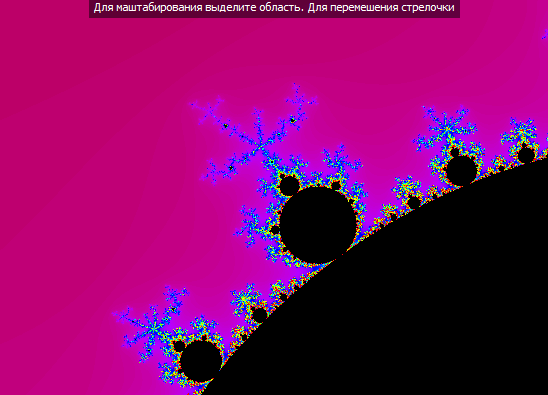
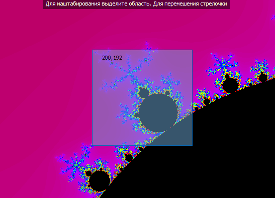

# MandelbrotFractal

Documentation(Dozywizard): https://catonearth.github.io/MandelbrotFractal/html/

You can control the fractal in two modes. In the first mode, you can zoom in on the picture using the "+" and "-" buttons. In another mode, you can select the areas you want to zoom in on. You can use the mouse and arrows to move the picture.

    Screenshot welcome dialog:  

    

    Screenshot fractal:  

    

    Screenshot fractal:  

    

    Screenshot set fractal:  

    

